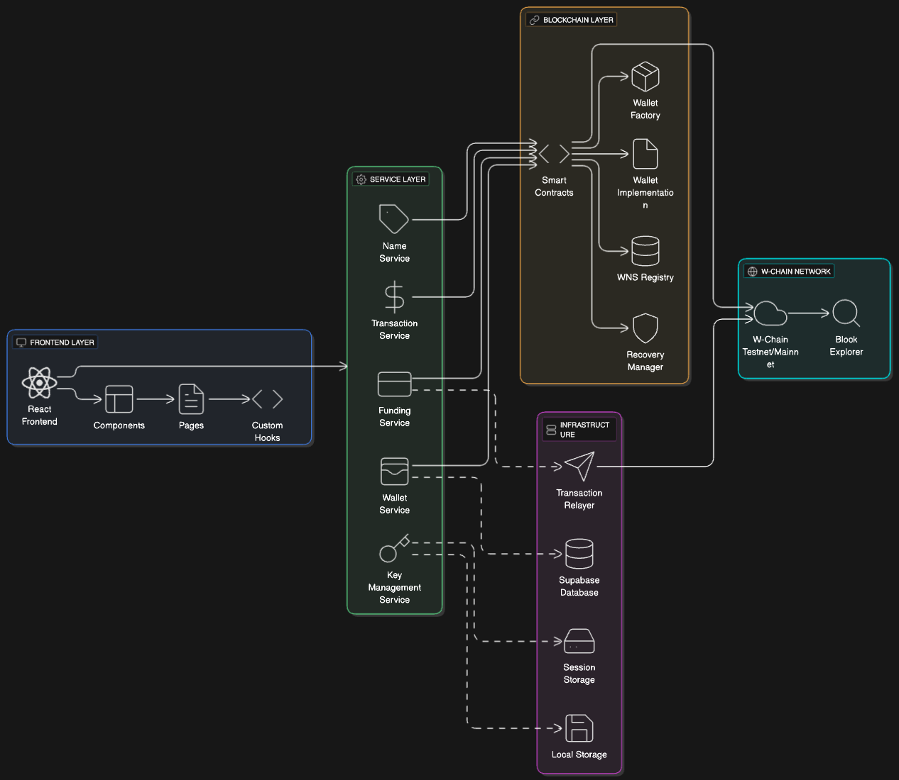
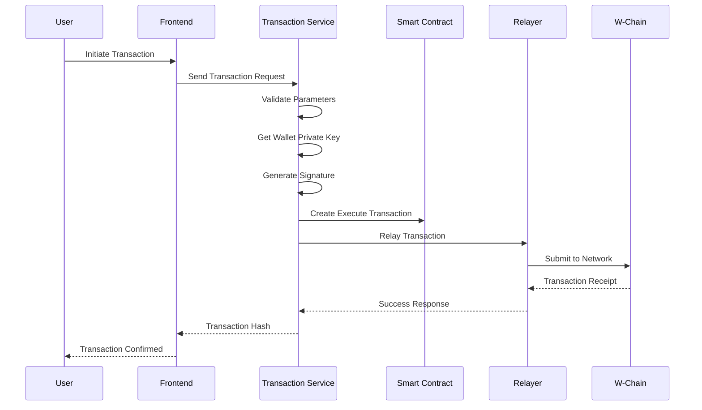

# W-Access

A comprehensive Web3 wallet management platform built specifically for the W-Chain ecosystem. W-Access simplifies wallet creation, management, and transactions while providing enterprise-grade security and user-friendly features.

## 🚀 Features

### Core Features
- **Smart Contract Wallets**: Non-custodial wallet creation using EIP-1167 minimal proxies
- **Human-Readable Names**: W-Chain Name Service (WNS) for memorable wallet addresses
- **Secure Recovery**: Social recovery system with guardian-based wallet recovery
- **PIN Authentication**: Secure PIN-based access without exposing private keys
- **Transaction Sponsorship**: Automatic gas fee sponsorship for expensive transactions
- **Session Management**: Secure session-based wallet access with automatic expiration
- **Multi-Network Support**: Full support for both W-Chain Testnet and Mainnet
- **Network Switching**: Seamless switching between testnet and mainnet environments

### User Experience
- **Instant Wallet Creation**: Create wallets in seconds with streamlined onboarding
- **Mobile Optimized**: Responsive design for all devices
- **Real-time Balance**: Live wallet balance updates
- **Transaction History**: Complete transaction tracking and history
- **Multi-wallet Support**: Manage multiple wallets in a single interface

### Security Features
- **Non-custodial**: Users maintain full control of their private keys
- **Encrypted Storage**: PIN-encrypted long-term key storage
- **Session Security**: Automatic key expiration and cleanup
- **Social Recovery**: Guardian-based wallet recovery system
- **Enterprise Security**: Advanced security features for team management

## 🏗️ Architecture



## 📁 Project Structure

```
w-access/
├── src/
│   ├── components/           # React components
│   │   ├── ui/              # Reusable UI components
│   │   ├── wallet/          # Wallet-specific components
│   │   └── *.tsx            # Feature components
│   ├── pages/               # Application pages
│   ├── lib/                 # Core services and utilities
│   │   ├── abi/             # Smart contract ABIs
│   │   ├── addresses.ts     # Contract addresses
│   │   ├── crypto.ts        # Cryptographic utilities
│   │   ├── database.ts      # Database operations
│   │   ├── eth.ts           # Ethereum utilities
│   │   ├── funding.ts       # Wallet funding service
│   │   ├── key-management.ts # Key storage and encryption
│   │   ├── name-resolution.ts # WNS resolution
│   │   ├── session.ts       # Session management
│   │   ├── supabase.ts      # Supabase client
│   │   └── transaction.ts   # Transaction handling
│   ├── hooks/               # Custom React hooks
│   ├── contracts/           # Smart contract source code
│   └── App.tsx              # Main application component
├── public/                  # Static assets
├── supabase/                # Supabase configuration
└── dist/                    # Build output
```

## 🛠️ Technology Stack

### Frontend
- **React 18** - Modern React with hooks and functional components
- **TypeScript** - Type-safe development
- **Vite** - Fast build tool and development server
- **Tailwind CSS** - Utility-first CSS framework
- **Framer Motion** - Smooth animations and transitions
- **Radix UI** - Accessible component primitives
- **React Router** - Client-side routing

### Blockchain
- **Viem** - Type-safe Ethereum library
- **Ethers.js** - Ethereum utilities
- **Solidity 0.8.3** - Smart contract development
- **EIP-1167** - Minimal proxy standard for gas-efficient wallet creation

### Backend & Infrastructure
- **Supabase** - PostgreSQL database and real-time subscriptions
- **Web Crypto API** - Client-side encryption
- **Session Storage** - Secure temporary key storage
- **Local Storage** - Encrypted long-term key storage

## 🚀 Getting Started

### Prerequisites

- Node.js 18+ 
- npm or yarn
- Git

### Installation

1. **Clone the repository**
   ```bash
   git clone https://github.com/your-org/w-access.git
   cd w-access
   ```

2. **Install dependencies**
   ```bash
   npm install
   ```

3. **Environment Setup**
   ```bash
   cp env.example .env
   ```
   
   Configure the following environment variables:
   ```env
   # Supabase Configuration
   VITE_SUPABASE_URL=your_supabase_url
   VITE_SUPABASE_ANON_KEY=your_supabase_anon_key
   
   # Server Configuration (for wallet funding)
   VITE_SERVER_PRIVATE_KEY=your_server_private_key
   
   # Network Configuration
   VITE_NETWORK_TYPE=testnet  # or 'mainnet'
   VITE_TESTNET_URL=https://testnet.w-access.xyz
   VITE_MAINNET_URL=https://w-access.xyz
   ```

4. **Database Setup**
   
   Run the Supabase setup script:
   ```bash
   # Execute the SQL schema in your Supabase dashboard
   cat src/lib/supabase-setup.sql
   ```

5. **Start Development Server**
   ```bash
   npm run dev
   ```

6. **Build for Production**
   ```bash
   npm run build
   ```

## 📋 Smart Contracts

### W-Chain Testnet (Chain ID: 71117)

#### Wallet Factory (`0x52d50D41FABB1A2C3434cA79d9a3963D9140C7De`)
- Creates new smart contract wallets using EIP-1167 minimal proxies
- Manages wallet initialization and ownership
- Provides deterministic address prediction
- **Network**: W-Chain Testnet
- **Explorer**: [View on Explorer](https://explorer.w-chain.com/address/0x52d50D41FABB1A2C3434cA79d9a3963D9140C7De)

#### Wallet Implementation (`0x440Df1c316041B15F08298Da6c267B38Dcd3aE7c`)
- Core wallet functionality with EIP-1271 signature validation
- Social recovery system with guardian management
- Batch transaction execution
- Nonce-based transaction ordering
- **Network**: W-Chain Testnet
- **Explorer**: [View on Explorer](https://explorer.w-chain.com/address/0x440Df1c316041B15F08298Da6c267B38Dcd3aE7c)

#### WNS Registry (`0x269ca8D0fB38Fe18435B2AC70911487ED340B2F3`)
- Human-readable name registration and resolution
- Name-to-address and address-to-name mapping
- Name transfer and update functionality
- **Network**: W-Chain Testnet
- **Explorer**: [View on Explorer](https://explorer.w-chain.com/address/0x269ca8D0fB38Fe18435B2AC70911487ED340B2F3)

#### Recovery Manager (`0x7C2930C0AA1E7A17694EdF82e6d1Ae4E6ef3f607`)
- Manages social recovery processes
- Guardian coordination and recovery execution
- Recovery cooldown and security features
- **Network**: W-Chain Testnet
- **Explorer**: [View on Explorer](https://explorer.w-chain.com/address/0x7C2930C0AA1E7A17694EdF82e6d1Ae4E6ef3f607)

### W-Chain Mainnet (Chain ID: 171717)

#### WNS Registry (`0xbcBC65828Afea72b83C8a07666226d3319739b62`)
- Human-readable name registration and resolution
- Name-to-address and address-to-name mapping
- Name transfer and update functionality
- **Network**: W-Chain Mainnet
- **Explorer**: [View on Explorer](https://explorer.w-chain.com/address/0xbcBC65828Afea72b83C8a07666226d3319739b62)

#### Wallet Implementation (`0x269ca8D0fB38Fe18435B2AC70911487ED340B2F3`)
- Core wallet functionality with EIP-1271 signature validation
- Social recovery system with guardian management
- Batch transaction execution
- Nonce-based transaction ordering
- **Network**: W-Chain Mainnet
- **Explorer**: [View on Explorer](https://explorer.w-chain.com/address/0x269ca8D0fB38Fe18435B2AC70911487ED340B2F3)

#### Wallet Factory (`0x440Df1c316041B15F08298Da6c267B38Dcd3aE7c`)
- Creates new smart contract wallets using EIP-1167 minimal proxies
- Manages wallet initialization and ownership
- Provides deterministic address prediction
- **Network**: W-Chain Mainnet
- **Explorer**: [View on Explorer](https://explorer.w-chain.com/address/0x440Df1c316041B15F08298Da6c267B38Dcd3aE7c)

#### Recovery Manager (`0x52d50D41FABB1A2C3434cA79d9a3963D9140C7De`)
- Manages social recovery processes
- Guardian coordination and recovery execution
- Recovery cooldown and security features
- **Network**: W-Chain Mainnet
- **Explorer**: [View on Explorer](https://explorer.w-chain.com/address/0x52d50D41FABB1A2C3434cA79d9a3963D9140C7De)

## 🌐 Network Support

### W-Chain Testnet (Chain ID: 71117)
- **RPC URL**: `https://rpc-testnet.w-chain.com`
- **Explorer**: `https://explorer.w-chain.com`
- **Purpose**: Development and testing
- **Status**: ✅ Active

### W-Chain Mainnet (Chain ID: 171717)
- **RPC URL**: `https://rpc.w-chain.com`
- **Explorer**: `https://explorer.w-chain.com`
- **Purpose**: Production deployment
- **Status**: ✅ Active

### Network Switching
The application supports seamless switching between testnet and mainnet:
- Automatic network detection based on environment variables
- Persistent network selection in localStorage
- Network-specific contract addresses and configurations
- Cross-network URL generation for easy switching

## 🔐 Security Features

### Key Management
- **Session Storage**: Temporary key storage with 30-minute expiration
- **PIN Encryption**: AES-GCM encryption with PBKDF2 key derivation
- **Automatic Cleanup**: Expired keys are automatically removed
- **No Server Storage**: Private keys never leave the client

### Transaction Security
- **Signature Validation**: EIP-1271 compliant signature verification
- **Nonce Management**: Prevents replay attacks
- **Gas Price Protection**: Prevents gas price manipulation
- **Transaction Sponsorship**: Automatic gas fee handling

### Recovery System
- **Guardian-based Recovery**: Social recovery with trusted guardians
- **Cooldown Period**: 2-day cooldown for recovery initiation
- **Multi-signature Support**: Multiple guardian approval system
- **Recovery Cancellation**: Owner can cancel pending recoveries

## 🔄 Transaction Flow



## 🎯 Key Services

### TransactionService
Handles all blockchain transactions with smart contract wallets:
- Gas price optimization
- Transaction sponsorship
- Signature generation
- Error handling and retry logic

### KeyManagementService
Manages wallet keys securely:
- Session-based temporary storage
- PIN-encrypted long-term storage
- Automatic key expiration
- Secure key derivation

### WalletService
Database operations for wallet management:
- Wallet creation and retrieval
- Session-based wallet association
- Recovery method management
- Wallet statistics

### FundingService
Handles wallet funding and gas sponsorship:
- Automatic wallet funding
- Gas fee sponsorship
- Server balance management
- Transaction relaying

## 📊 Database Schema

### Wallets Table
```sql
CREATE TABLE wallets (
  id UUID PRIMARY KEY DEFAULT gen_random_uuid(),
  user_id UUID,
  session_id UUID,
  name VARCHAR(255) NOT NULL,
  address VARCHAR(42) NOT NULL UNIQUE,
  seed_phrase_hash VARCHAR(255) NOT NULL,
  created_at TIMESTAMP DEFAULT NOW(),
  updated_at TIMESTAMP DEFAULT NOW()
);
```

### Recovery Methods Table
```sql
CREATE TABLE recovery_methods (
  id UUID PRIMARY KEY DEFAULT gen_random_uuid(),
  wallet_id UUID REFERENCES wallets(id) ON DELETE CASCADE,
  type VARCHAR(50) NOT NULL,
  value VARCHAR(255) NOT NULL,
  is_verified BOOLEAN DEFAULT FALSE,
  created_at TIMESTAMP DEFAULT NOW()
);
```

## 🚀 Deployment

### Vercel Deployment
1. Connect your GitHub repository to Vercel
2. Configure environment variables in Vercel dashboard
3. Deploy automatically on push to main branch

### Manual Deployment
1. Build the application: `npm run build`
2. Upload the `dist` folder to your hosting provider
3. Configure environment variables
4. Set up Supabase database

## 🤝 Contributing

1. Fork the repository
2. Create a feature branch: `git checkout -b feature/amazing-feature`
3. Commit your changes: `git commit -m 'Add amazing feature'`
4. Push to the branch: `git push origin feature/amazing-feature`
5. Open a Pull Request

## 📝 License

This project is licensed under the MIT License - see the [LICENSE](LICENSE) file for details.

## 🆘 Support

For support and questions:
- Create an issue in the GitHub repository
- Check the documentation in the `/docs` folder
- Review the smart contract documentation

## 🔮 Roadmap

### Phase 1 (Current) ✅
- ✅ Smart contract wallet creation
- ✅ Basic transaction functionality
- ✅ PIN-based authentication
- ✅ Session management
- ✅ W-Chain Name Service (WNS)
- ✅ Multi-network support (Testnet & Mainnet)
- ✅ Transaction sponsorship system

### Phase 2 (Coming Soon) 🚧
- 🔄 **Enhanced Recovery System**
  - Multi-guardian recovery with customizable thresholds
  - Time-locked recovery with emergency procedures
  - Recovery method verification and backup systems
- 🔄 **Advanced Security Features**
  - Hardware wallet integration
  - Biometric authentication support
  - Advanced threat detection and monitoring
- 🔄 **Mobile App Development**
  - Native iOS and Android applications
  - Mobile-optimized wallet management
  - Push notifications for transactions and recovery
- 🔄 **W-Access SDK Release** 🎯
  - **JavaScript/TypeScript SDK** for easy integration
  - **React components library** for quick UI implementation
  - **API wrapper** for backend integrations
  - **Documentation and examples** for developers
  - **Support for other W-Chain applications** to integrate W-Access

### Phase 3 (Planned) 📋
- 📋 **DeFi Integration**
  - Built-in DEX integration
  - Yield farming and staking interfaces
  - Portfolio management and analytics
- 📋 **NFT Support**
  - NFT marketplace integration
  - Collection management
  - Cross-platform NFT transfers
- 📋 **Cross-chain Functionality**
  - Bridge integrations
  - Multi-chain wallet support
  - Cross-chain transaction routing
- 📋 **Enterprise Features**
  - Team wallet management
  - Advanced governance systems
  - Enterprise security protocols
  - Compliance and audit tools

### SDK Integration Benefits 🛠️
The upcoming W-Access SDK will enable other W-Chain applications to:
- **Seamlessly integrate** wallet functionality into their projects
- **Reduce development time** with pre-built components
- **Maintain security standards** with battle-tested wallet infrastructure
- **Access W-Chain ecosystem** features like WNS and recovery systems
- **Provide consistent user experience** across W-Chain applications

---

**Built with ❤️ for the W-Chain ecosystem**