# W-Access System Flow Diagrams

This document contains comprehensive flow diagrams for the W-Access system, covering wallet creation, transaction processing, recovery processes, and network operations.

## 1. Wallet Creation Flow

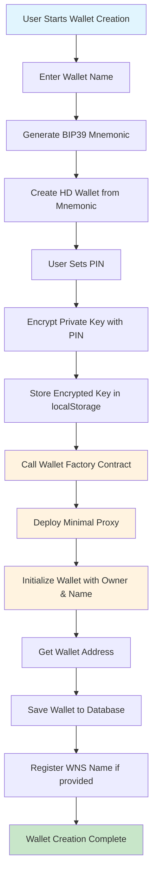

## 2. Transaction Execution Flow

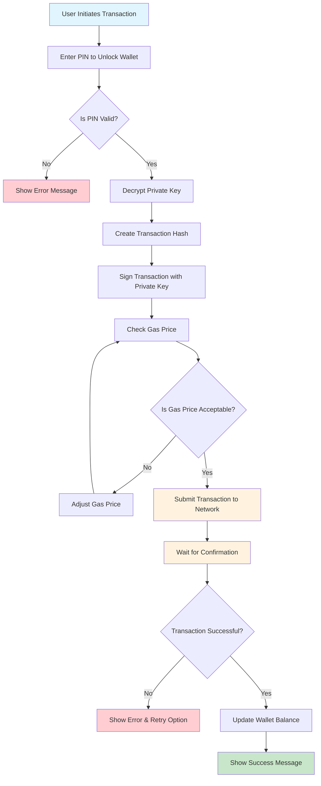

## 3. Social Recovery Flow

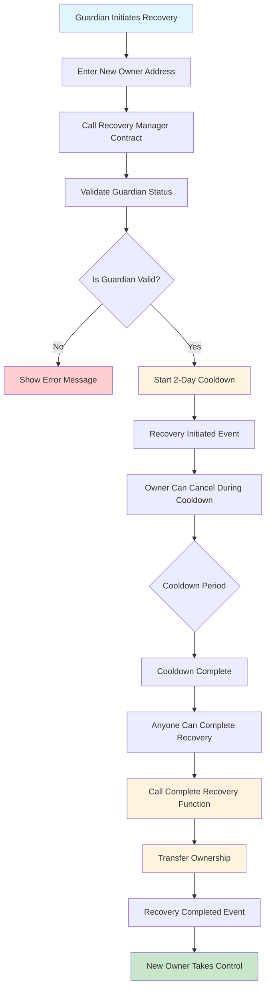

## 4. PIN Authentication Flow

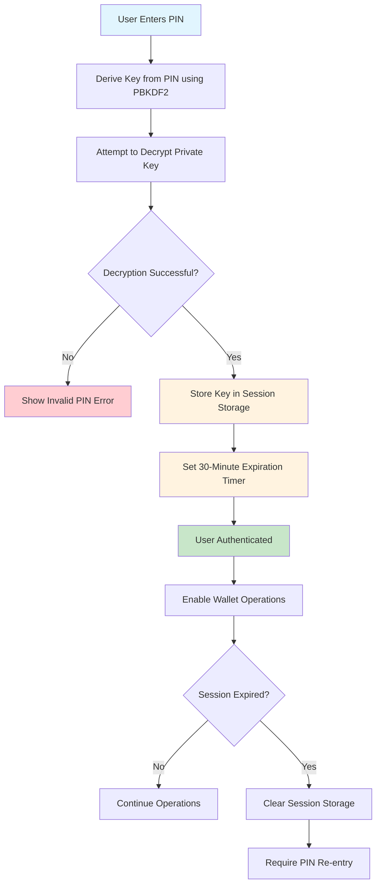

## 5. WNS Name Registration Flow

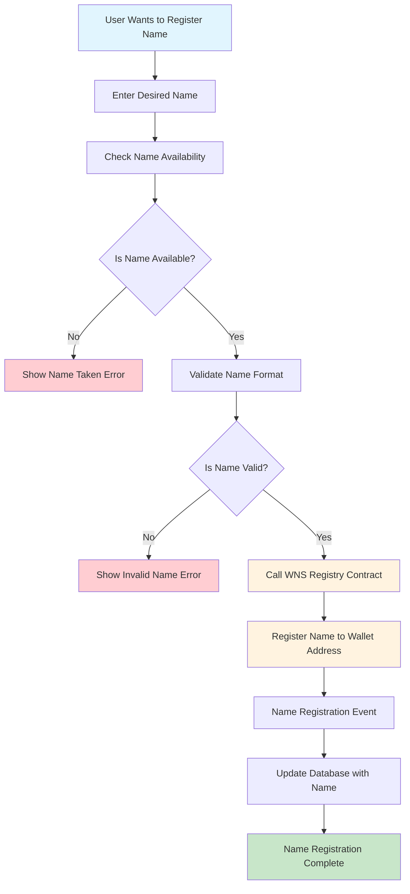

## 6. Network Switching Flow

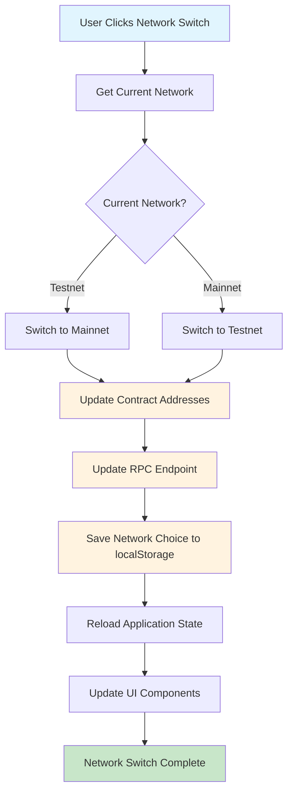

## 7. Transaction Sponsorship Flow

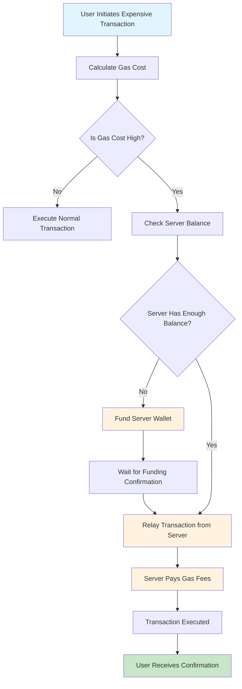

## 8. Guardian Management Flow

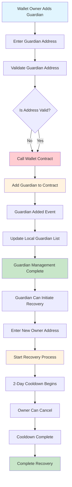

## 9. Batch Transaction Flow

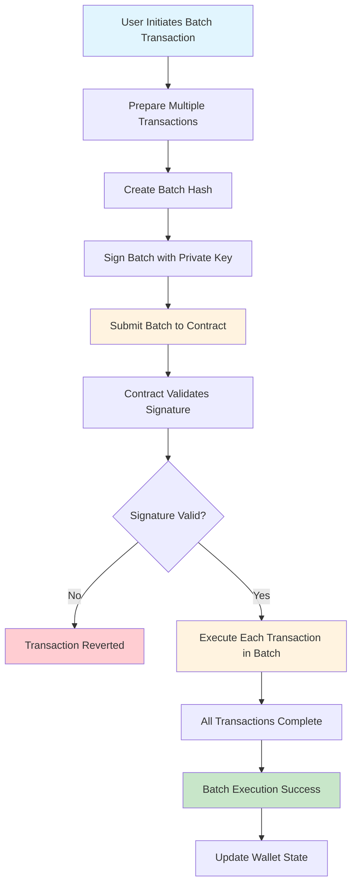

## 10. System Architecture Overview

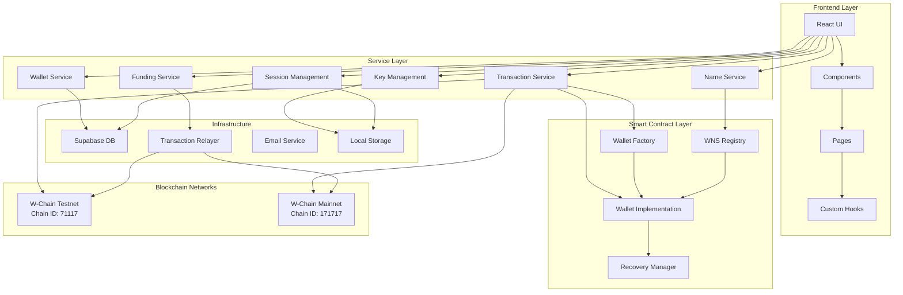

## 11. Security Flow Overview

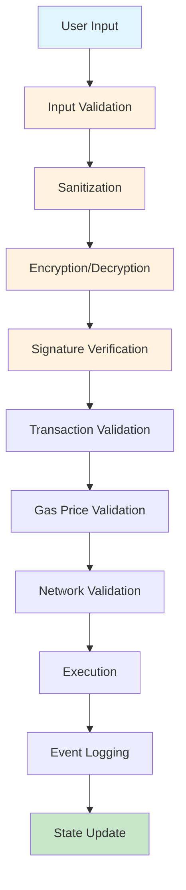

## 12. Error Handling Flow

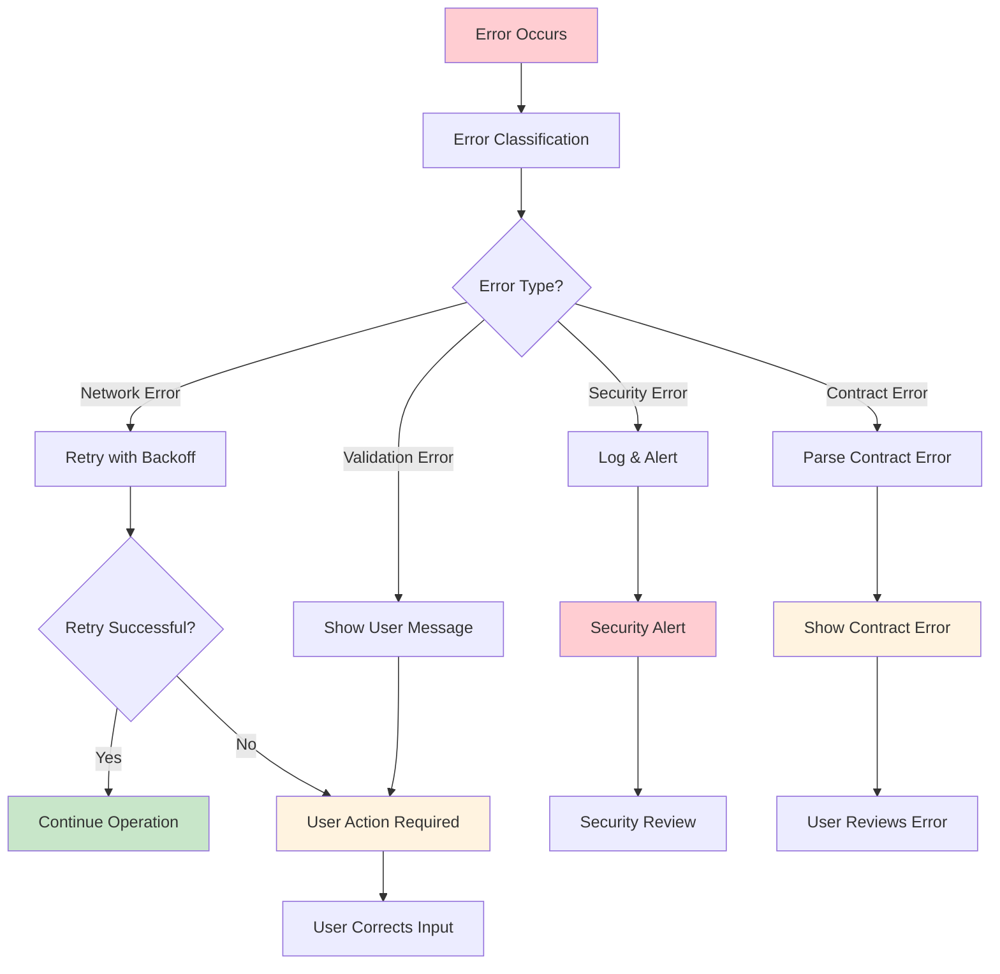

---

**Document Version**: 1.0  
**Last Updated**: [Current Date]  
**Purpose**: Comprehensive system flow documentation for W-Access platform
