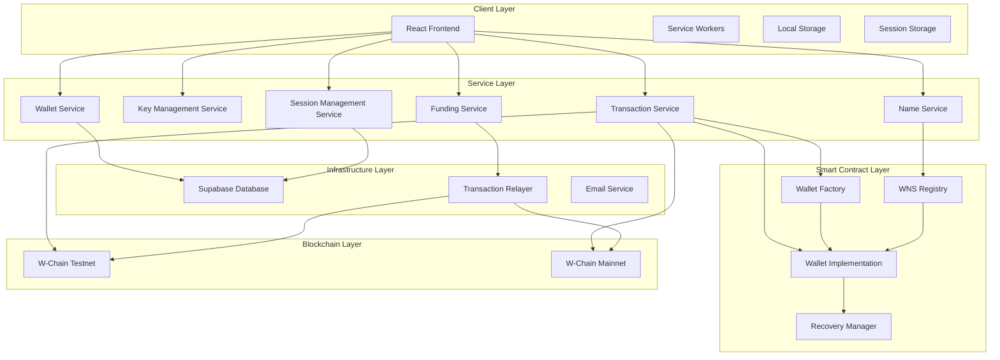
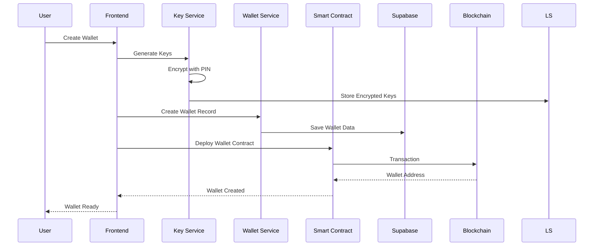

# W-Access Technical Documentation

## Table of Contents
1. [System Overview](#system-overview)
2. [Architecture](#architecture)
3. [Smart Contract System](#smart-contract-system)
4. [Core Features Implementation](#core-features-implementation)
5. [Security Architecture](#security-architecture)
6. [Network Support](#network-support)
7. [Technical Challenges Addressed](#technical-challenges-addressed)
8. [Deployment Information](#deployment-information)
9. [API Documentation](#api-documentation)
10. [Development Guidelines](#development-guidelines)

## System Overview

W-Access is a comprehensive Web3 wallet management platform built specifically for the W-Chain ecosystem. The system provides a complete solution for creating, managing, and securing smart contract wallets with advanced features like social recovery, human-readable names, and transaction sponsorship.

### Key Components
- **Frontend**: React-based user interface with TypeScript
- **Smart Contracts**: Solidity contracts for wallet functionality
- **Backend Services**: Supabase for data persistence and session management
- **Blockchain Integration**: Direct interaction with W-Chain networks
- **Security Layer**: PIN-based authentication and encrypted key storage

## Architecture

### High-Level Architecture



### Component Interaction Flow



## Smart Contract System

### Contract Architecture

The smart contract system consists of four main contracts:

#### 1. Wallet Factory (`WalletFactory.sol`)
**Purpose**: Creates new smart contract wallets using EIP-1167 minimal proxies

**Key Features**:
- Gas-efficient wallet creation using minimal proxies
- Deterministic address prediction
- Event emission for wallet creation tracking

**Core Functions**:
```solidity
function createWallet(string calldata _name) external returns (address)
function predictWalletAddress(string calldata _name, address _owner) external view returns (address)
```

**Deployment Addresses**:
- Testnet: `0x52d50D41FABB1A2C3434cA79d9a3963D9140C7De`
- Mainnet: `0x440Df1c316041B15F08298Da6c267B38Dcd3aE7c`

#### 2. Wallet Implementation (`WalletImplementation.sol`)
**Purpose**: Core wallet functionality with advanced security features

**Key Features**:
- EIP-1271 signature validation
- Social recovery system
- Batch transaction execution
- Nonce-based transaction ordering
- Guardian management

**Core Functions**:
```solidity
function execute(address dest, uint256 value, bytes calldata func, bytes calldata signature) external returns (bytes memory)
function executeBatch(address[] calldata destinations, uint256[] calldata values, bytes[] calldata functionCalls, bytes calldata signature) external returns (bytes[] memory)
function initiateRecovery(address newOwner) external
function completeRecovery() external
function addGuardian(address guardian) external
```

**Deployment Addresses**:
- Testnet: `0x440Df1c316041B15F08298Da6c267B38Dcd3aE7c`
- Mainnet: `0x269ca8D0fB38Fe18435B2AC70911487ED340B2F3`

#### 3. WNS Registry (`WNSRegistry.sol`)
**Purpose**: Human-readable name service for wallet addresses

**Key Features**:
- Name registration and resolution
- Name-to-address mapping
- Name transfer functionality
- Name availability checking

**Core Functions**:
```solidity
function registerName(string calldata _name, address _wallet) external
function updateName(string calldata _newName) external
function transferName(address _newWallet) external
function isNameAvailable(string calldata _name) external view returns (bool)
```

**Deployment Addresses**:
- Testnet: `0x269ca8D0fB38Fe18435B2AC70911487ED340B2F3`
- Mainnet: `0xbcBC65828Afea72b83C8a07666226d3319739b62`

#### 4. Recovery Manager (`RecoveryManager.sol`)
**Purpose**: Manages social recovery processes and guardian coordination

**Key Features**:
- Guardian management
- Recovery request handling
- Cooldown period enforcement
- Recovery execution

**Core Functions**:
```solidity
function addGuardian(address wallet, address guardian) external
function initiateRecovery(address wallet, address newOwner) external
function completeRecovery(address wallet) external
function cancelRecovery(address wallet) external
```

**Deployment Addresses**:
- Testnet: `0x7C2930C0AA1E7A17694EdF82e6d1Ae4E6ef3f607`
- Mainnet: `0x52d50D41FABB1A2C3434cA79d9a3963D9140C7De`

## Core Features Implementation

### 1. Smart Contract Wallet Creation

**Process Flow**:
1. User generates wallet keys using BIP39 mnemonic
2. Keys are encrypted with user PIN using AES-GCM
3. Wallet factory contract creates minimal proxy
4. Wallet implementation is initialized with owner and name
5. Wallet address is returned and stored in database

**Technical Implementation**:
```typescript
// Key generation
const mnemonic = generateMnemonic();
const wallet = ethers.Wallet.fromMnemonic(mnemonic);

// Wallet creation
const factory = new ethers.Contract(factoryAddress, factoryABI, signer);
const tx = await factory.createWallet(walletName);
const receipt = await tx.wait();
const walletAddress = receipt.events[0].args.wallet;
```

### 2. PIN-Based Authentication

**Security Model**:
- PIN is used to derive encryption key using PBKDF2
- Private keys are encrypted with AES-GCM
- Session-based temporary key storage
- Automatic key expiration after 30 minutes

**Implementation**:
```typescript
// PIN-based key derivation
const key = await crypto.subtle.importKey(
  'raw',
  new TextEncoder().encode(pin),
  'PBKDF2',
  false,
  ['deriveBits']
);

const derivedKey = await crypto.subtle.deriveBits(
  {
    name: 'PBKDF2',
    salt: new Uint8Array(16),
    iterations: 100000,
    hash: 'SHA-256'
  },
  key,
  256
);
```

### 3. Social Recovery System

**Recovery Process**:
1. Guardian initiates recovery with new owner address
2. 2-day cooldown period begins
3. Owner can cancel recovery during cooldown
4. After cooldown, anyone can complete recovery
5. Ownership is transferred to new owner

**Security Features**:
- Multiple guardian support (up to 10 guardians)
- Cooldown period prevents immediate recovery
- Owner can cancel pending recoveries
- Guardian validation before recovery initiation

### 4. Transaction Sponsorship

**Gas Sponsorship System**:
- Server maintains funding wallet
- Automatic gas fee calculation
- Transaction relaying for sponsored transactions
- Balance monitoring and refilling

**Implementation**:
```typescript
// Transaction sponsorship
const gasPrice = await provider.getGasPrice();
const gasLimit = await contract.estimateGas.execute(...);
const totalCost = gasPrice.mul(gasLimit);

// Check server balance and fund if needed
if (serverBalance.lt(totalCost)) {
  await fundServerWallet(totalCost);
}
```

### 5. W-Chain Name Service (WNS)

**Name Registration**:
- Human-readable names for wallet addresses
- Name uniqueness validation
- Name-to-address resolution
- Name transfer between wallets

**Features**:
- Minimum 4 character names
- Case-insensitive resolution
- One name per wallet
- Name release functionality

## Security Architecture

### Key Management Security

**Encryption Standards**:
- AES-GCM encryption for private keys
- PBKDF2 key derivation (100,000 iterations)
- Random salt generation
- Secure key storage in localStorage

**Session Security**:
- 30-minute session expiration
- Automatic key cleanup
- No server-side key storage
- Client-side key management only

### Transaction Security

**Signature Validation**:
- EIP-1271 compliant signature verification
- Nonce-based transaction ordering
- Chain ID validation
- Replay attack prevention

**Gas Price Protection**:
- Dynamic gas price calculation
- Gas price validation
- Transaction sponsorship for expensive operations
- Automatic retry with adjusted gas prices

### Recovery Security

**Guardian System**:
- Multiple guardian support
- Guardian validation
- Recovery cooldown period
- Owner cancellation rights

**Recovery Process Security**:
- 2-day cooldown period
- Guardian-only initiation
- Public completion (anyone can complete valid recovery)
- Event emission for transparency

## Network Support

### W-Chain Testnet (Chain ID: 71117)
- **Purpose**: Development and testing
- **RPC URL**: `https://rpc-testnet.w-chain.com`
- **Explorer**: `https://explorer.w-chain.com`
- **Status**: Active

### W-Chain Mainnet (Chain ID: 171717)
- **Purpose**: Production deployment
- **RPC URL**: `https://rpc.w-chain.com`
- **Explorer**: `https://explorer.w-chain.com`
- **Status**: Active

### Network Switching Implementation

**Automatic Network Detection**:
```typescript
export function getCurrentNetwork(): 'testnet' | 'mainnet' {
  if (import.meta.env.VITE_NETWORK_TYPE) {
    return import.meta.env.VITE_NETWORK_TYPE as 'testnet' | 'mainnet';
  }
  
  if (typeof window !== "undefined") {
    const storedNetwork = localStorage.getItem('w-chain-network');
    if (storedNetwork === 'mainnet' || storedNetwork === 'testnet') {
      return storedNetwork as 'testnet' | 'mainnet';
    }
  }
  
  return 'testnet';
}
```

**Contract Address Management**:
```typescript
export const ADDRESSES = {
  71117: { // Testnet
    WNSRegistry: "0x269ca8D0fB38Fe18435B2AC70911487ED340B2F3",
    WalletImplementation: "0x440Df1c316041B15F08298Da6c267B38Dcd3aE7c",
    WalletFactory: "0x52d50D41FABB1A2C3434cA79d9a3963D9140C7De",
    RecoveryManager: "0x7C2930C0AA1E7A17694EdF82e6d1Ae4E6ef3f607",
  },
  171717: { // Mainnet
    WNSRegistry: "0xbcBC65828Afea72b83C8a07666226d3319739b62",
    WalletImplementation: "0x269ca8D0fB38Fe18435B2AC70911487ED340B2F3",
    WalletFactory: "0x440Df1c316041B15F08298Da6c267B38Dcd3aE7c",
    RecoveryManager: "0x52d50D41FABB1A2C3434cA79d9a3963D9140C7De",
  },
} as const;
```

## Technical Challenges Addressed

### 1. Gas Optimization
**Challenge**: Smart contract wallet creation and operations can be expensive
**Solution**: 
- EIP-1167 minimal proxies for gas-efficient wallet creation
- Batch transaction execution
- Transaction sponsorship system
- Dynamic gas price optimization

### 2. Key Security
**Challenge**: Secure storage and management of private keys
**Solution**:
- PIN-based encryption with AES-GCM
- Session-based temporary storage
- No server-side key storage
- Automatic key expiration

### 3. User Experience
**Challenge**: Complex Web3 interactions for non-technical users
**Solution**:
- Simplified wallet creation process
- PIN-based authentication
- Human-readable names
- Automatic transaction sponsorship

### 4. Recovery System
**Challenge**: Secure wallet recovery without centralization
**Solution**:
- Social recovery with guardians
- Cooldown periods for security
- Multiple guardian support
- Owner cancellation rights

### 5. Network Compatibility
**Challenge**: Supporting multiple networks with different configurations
**Solution**:
- Environment-based network detection
- Dynamic contract address management
- Network-specific configurations
- Seamless network switching

## Deployment Information

### Smart Contract Deployment

**Testnet Deployment**:
- Network: W-Chain Testnet (Chain ID: 71117)
- Deployment Date: [To be filled]
- Gas Used: [To be filled]
- Transaction Hash: [To be filled]

**Mainnet Deployment**:
- Network: W-Chain Mainnet (Chain ID: 171717)
- Deployment Date: [To be filled]
- Gas Used: [To be filled]
- Transaction Hash: [To be filled]

### Contract Verification
All contracts are verified on the W-Chain explorer:
- [Wallet Factory Testnet](https://explorer.w-chain.com/address/0x52d50D41FABB1A2C3434cA79d9a3963D9140C7De)
- [Wallet Implementation Testnet](https://explorer.w-chain.com/address/0x440Df1c316041B15F08298Da6c267B38Dcd3aE7c)
- [WNS Registry Testnet](https://explorer.w-chain.com/address/0x269ca8D0fB38Fe18435B2AC70911487ED340B2F3)
- [Recovery Manager Testnet](https://explorer.w-chain.com/address/0x7C2930C0AA1E7A17694EdF82e6d1Ae4E6ef3f607)

### Frontend Deployment
- **Testnet**: https://testnet.w-access.xyz
- **Mainnet**: https://w-access.xyz
- **Platform**: Vercel
- **CDN**: Global edge network

## API Documentation

### Database Schema

**Wallets Table**:
```sql
CREATE TABLE wallets (
  id UUID PRIMARY KEY DEFAULT gen_random_uuid(),
  user_id UUID,
  session_id UUID,
  name VARCHAR(255) NOT NULL,
  address VARCHAR(42) NOT NULL UNIQUE,
  seed_phrase_hash VARCHAR(255) NOT NULL,
  created_at TIMESTAMP DEFAULT NOW(),
  updated_at TIMESTAMP DEFAULT NOW()
);
```

**Recovery Methods Table**:
```sql
CREATE TABLE recovery_methods (
  id UUID PRIMARY KEY DEFAULT gen_random_uuid(),
  wallet_id UUID REFERENCES wallets(id) ON DELETE CASCADE,
  type VARCHAR(50) NOT NULL,
  value VARCHAR(255) NOT NULL,
  is_verified BOOLEAN DEFAULT FALSE,
  created_at TIMESTAMP DEFAULT NOW()
);
```

### Service APIs

**Transaction Service**:
```typescript
interface TransactionService {
  sendTransaction(to: string, value: string, data?: string): Promise<string>;
  executeBatch(transactions: Transaction[]): Promise<string[]>;
  getTransactionStatus(txHash: string): Promise<TransactionStatus>;
}
```

**Key Management Service**:
```typescript
interface KeyManagementService {
  generateWallet(pin: string): Promise<Wallet>;
  unlockWallet(pin: string): Promise<boolean>;
  lockWallet(): Promise<void>;
  isWalletUnlocked(): boolean;
}
```

**Wallet Service**:
```typescript
interface WalletService {
  createWallet(name: string, address: string): Promise<Wallet>;
  getWallet(address: string): Promise<Wallet | null>;
  updateWallet(address: string, updates: Partial<Wallet>): Promise<void>;
  deleteWallet(address: string): Promise<void>;
}
```

## Development Guidelines

### Code Standards
- TypeScript for type safety
- ESLint for code quality
- Prettier for code formatting
- Husky for pre-commit hooks

### Testing Strategy
- Unit tests for utility functions
- Integration tests for smart contracts
- E2E tests for user workflows
- Security testing for key management

### Security Best Practices
- Never log private keys
- Use secure random number generation
- Validate all inputs
- Implement proper error handling
- Regular security audits

### Performance Optimization
- Lazy loading for components
- Code splitting for routes
- Memoization for expensive operations
- Efficient state management
- Optimized bundle size

---

**Document Version**: 1.0  
**Last Updated**: [Current Date]  
**Maintainer**: W-Access Development Team
